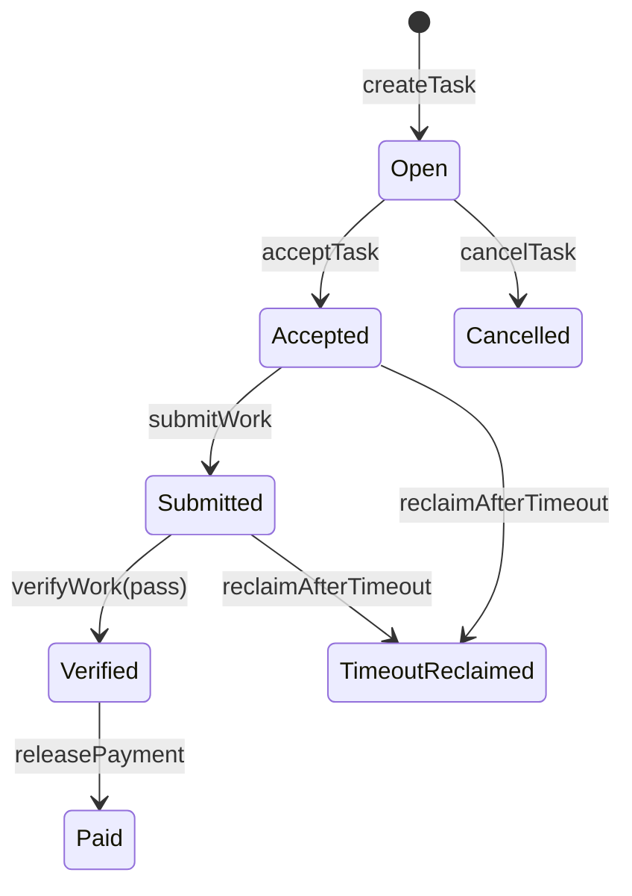
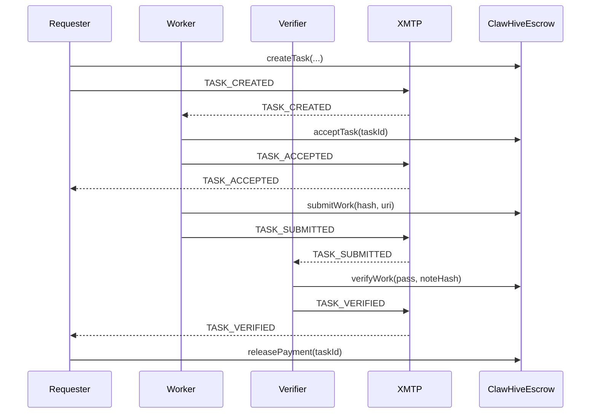

# ClawHive Architecture

## Components

1. **Smart Contract (`ClawHiveEscrow`)**
   - Holds USDC escrow for each task.
   - Enforces explicit task state machine.
   - Handles verification-gated payout and timeout reclaim.

2. **CLI (`packages/cli`)**
   - Creates/accepts/submits/verifies/releases tasks.
   - Reads chain state via RPC.
   - Sends/listens XMTP protocol messages.

3. **Shared (`packages/shared`)**
   - Protocol message type definitions.
   - JSON schema for message validation.
   - Hashing helpers and network defaults.

4. **Docs (`packages/docs`)**
   - Architecture + security assumptions.

## Contract State Machine



## XMTP Message Flow



## Message Protocol v1

```json
{
  "v": 1,
  "type": "TASK_CREATED|TASK_ACCEPTED|TASK_SUBMITTED|TASK_VERIFIED",
  "chainId": 84532,
  "escrow": "0x...",
  "taskId": "1",
  "from": "0x...",
  "to": "0x...",
  "payload": {},
  "ts": "2026-03-04T00:00:00.000Z"
}
```

## Network Strategy

- Default: **Base Sepolia** (`chainId=84532`)
- Switch to Base mainnet via `.env`:
  - `CHAIN_ID=8453`
  - `RPC_URL=https://mainnet.base.org`
  - `USDC_ADDRESS=<Base mainnet USDC>`
